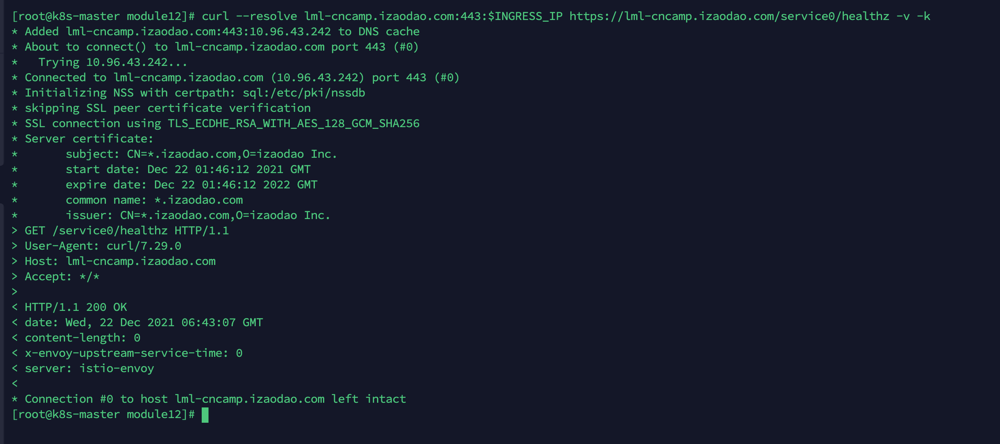
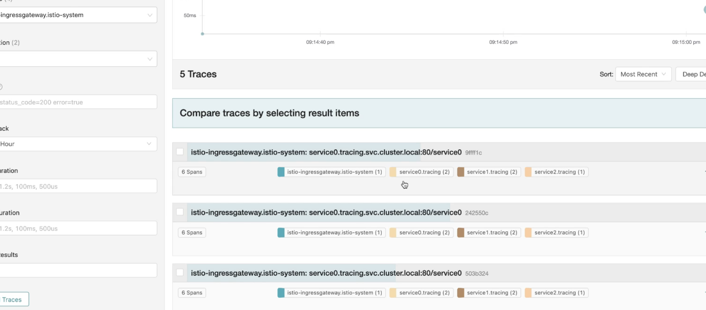

# 模块十二作业

### 作业要求

1. httpserver以istioIngressGateway形式发布出来
2. 安全保证
3. 7层路由规则
4. open tracing

### 完成过程

1. 安装istio,并且在我们想要运行的环境启用envoy的sidecar注入.
```
curl -L https://istio.io/downloadIstio | sh -
cd istio-1.12.0
cp bin/istioctl /usr/local/bin
istioctl install --set profile=demo -y
kubectl create ns httpserver
kubectl label ns httpserver istio-injection=enabled
```

2. 部署我们的service0.yaml、service1.yaml、service2.yaml
```
kubectl apply -f service0.yaml
kubectl apply -f service1.yaml
kubectl apply -f service2.yaml
```
3. 生成tls证书,并且以IngressGateway形式发布
``` 
openssl req -x509 -sha256 -nodes -days 365 -newkey rsa:2048 -subj '/O=cncamp Inc./CN=*.izaodao.com' -keyout httpserver.io.key -out httpserver.io.crt
kubectl create -n  istio-system secret tls service0-credential --key=httpserver.io.key --cert=httpserver.io.crt
kubectl apply -f istio-spec.yaml
```
4. 验证访问情况
``` 
# 查看IngressGateway的CLUSTER-IP
kubectl get service -n istio-system 
NAME                   TYPE           CLUSTER-IP
istio-ingressgateway   LoadBalancer   10.96.43.242
# 设置环境变量，并且访问我们的服务
export INGRESS_IP=10.96.43.242
# 同时验证tls和7层规则
curl --resolve lml-cncamp.izaodao.com:443:$INGRESS_IP https://lml-cncamp.izaodao.com/service0/healthz -v -k
```


5. 部署jaeger.yaml,并且查看jaeger
``` 
# 这里使用老师的yaml yaml地址https://github.com/cncamp/101/tree/master/module12/istio/tracing
```

