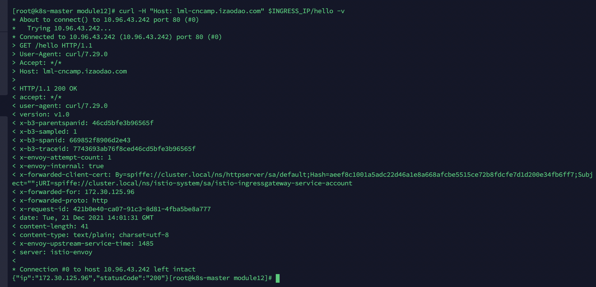
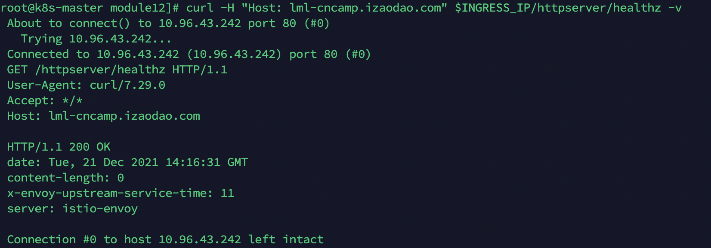

# 模块十二作业

### 作业要求

1. httpserver以istioIngressGateway形式发布出来
2. 安全保证
3. 7层路由规则
4. open tracing

### 完成过程

1. 安装istio,并且在我们想要运行的环境启用envoy的sidecar注入.
```
curl -L https://istio.io/downloadIstio | sh -
cd istio-1.12.0
cp bin/istioctl /usr/local/bin
istioctl install --set profile=demo -y
kubectl create ns httpserver
kubectl label ns httpserver istio-injection=enabled
```
2. 把我们之前的httpserver.yaml改到httpser的namespace.然后部署。会发现一个pod内会出现俩个容器
```
使用module12/httpser/目录下的httpserver.yaml
```
3. 将httpserver以istioIngressGateway形式发布
```
使用module12/httpser/目录下的httpserver-istio.yaml.添加gateway和对应的虚拟服务
```
4. 验证访问情况
```
# 查看IngressGateway的CLUSTER-IP
kubectl get service -n istio-system 
NAME                   TYPE           CLUSTER-IP
istio-ingressgateway   LoadBalancer   10.96.43.242
# 设置环境变量，并且访问我们的服务
export INGRESS_IP=10.96.43.242
curl -H "Host: lml-cncamp.izaodao.com" $INGRESS_IP/hello -v
```

```
验证七层路由规则
curl -H "Host: lml-cncamp.izaodao.com" $INGRESS_IP/httpserver/healthz -v
```


5. 添加tls能力
``` 
# 生成证书
openssl req -x509 -sha256 -nodes -days 365 -newkey rsa:2048 -subj '/O=cncamp Inc./CN=*.izaodao.com' -keyout httpserver.io.key -out httpserver.io.crt
# 创建tls secret
kubectl create -n  istio-system secret tls httpserver-credential --key=httpserver.io.key --cert=httpserver.io.crt
# 在httpserver-istio中添加tls
curl --resolve lml-cncamp.izaodao.com:443:$INGRESS_IP https://lml-cncamp.izaodao.com/httpserver/hello -v -k
curl --resolve lml-cncamp.izaodao.com:443:$INGRESS_IP https://lml-cncamp.izaodao.com/httpserver/healthz -v -k
```

6. 设置tracing

